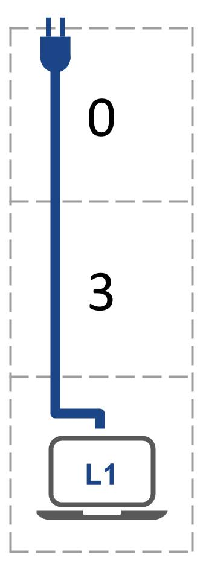
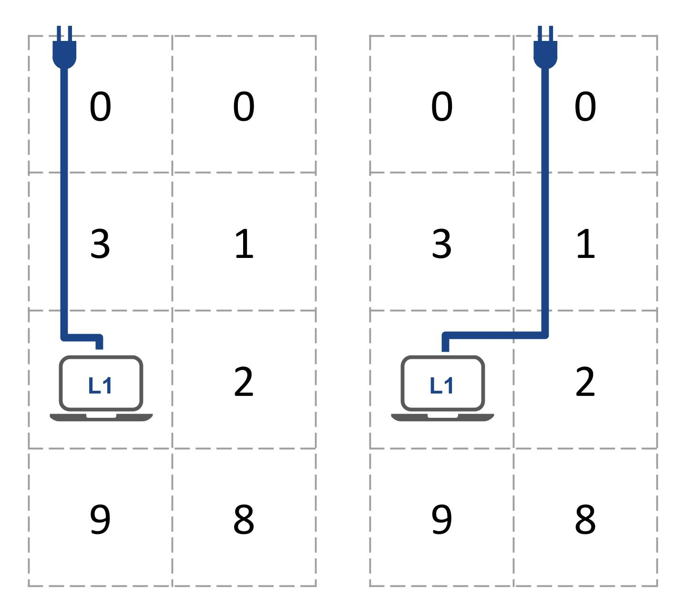
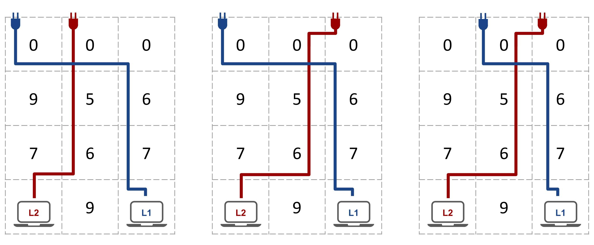

# Saklar Lhompat II (Sulit)

Ruang baca di perpustakaan Fasilkom UI berisi meja-meja yang tersusun atas R baris dan C kolom. Uniknya, meja-meja tersebut memiliki ketinggian berbeda-beda. Saat ini, terdapat N mahasiswa yang sedang berada di dalam ruang baca tersebut, dinomori dari 1 hingga N. Informasi ini dinyatakan oleh matriks G sebagai berikut:

- Jika meja (baris i, kolom j) kosong, maka G[i][j] berisi ketinggian meja tersebut, berupa sebuah bilangan bulat non-negatif.
- Jika meja (baris i, kolom j) ditempati mahasiswa, maka G[i][j] berisi -X (negatif X), dengan X adalah nomor mahasiswa tersebut.

Mahasiswa-mahasiswa tersebut menyalakan laptop mereka di meja masing-masing. Mereka perlu untuk menyambungkan kabel laptop masing-masing ke stop kontak. Stop-stop kontak hanya terdapat pada meja-meja pada baris pertama. Setiap meja pada baris pertama berisi satu stop kontak.

Untuk menghindari rebutan stop kontak, Pak Chanek, sang kepala pustakawan, akan menentukan stop kontak mana yang harus disambungkan ke laptop setiap mahasiswa. Setiap stop kontak di baris pertama akan disambungkan ke paling banyak satu laptop. Oleh Pak Chanek, penentuan ini disebut dengan "konfigurasi". Konfigurasi yang dipilih Pak Chanek akan selalu sedemikian sehingga, untuk setiap dua mahasiswa bernomor A dan B, apabila A < B, maka stop kontak yang harus disambungkan ke laptop mahasiswa A akan berada di sebelah kiri dari stop kontak yang harus disambungkan ke laptop mahasiswa B.

Untuk menyambungkan sebuah laptop ke sebuah stop kontak yang ditentukan Pak Chanek, kabel laptop harus bermula pada meja tempat mahasiswa pemilik laptop tersebut berada, kemudian melewati meja-meja lain sampai pada sebuah meja pada baris pertama. Setiap meja yang dilewati, kecuali meja pertama (yang berisi laptop), harus berada tepat di sebelah kiri, atas, kanan, atau bawah dari meja sebelumnya. Kabel laptop boleh melewati meja manapun, termasuk meja-meja lain pada baris pertama, meja-meja yang berisi laptop lain, maupun meja-meja yang dilewati kabel laptop lain.

Panjang kabel efektif sebuah penyambungan didefinisikan sebagai total dari:

- banyaknya meja yang dilewati, termasuk meja pertama dan meja terakhir, dan
- jumlah dari perbedaan tinggi dari setiap meja yang bersebelahan yang dilewati.

Setiap mahasiswa akan selalu memilih cara sedemikian sehingga panjang kabel efektif untuk menyambungkan laptopnya ke stop kontak yang telah ditentukan, sependek mungkin. Panjang terpendek ini didefinisikan sebagai "tingkat efisiensi penyambungan laptop" untuk mahasiswa tersebut.

Akhirnya, "tingkat kesemrawutan konfigurasi" didefinisikan sebagai tingkat efisiensi penyambungan laptop terbesar di antara N penyambungan laptop, pada konfigurasi tersebut.

Tentu saja, terdapat banyak konfigurasi yang dapat dipilih Pak Chanek. Tentukan jumlah dari tingkat kesemrawutan konfigurasi, untuk seluruh kemungkinan konfigurasi berbeda, modulo 1.000.000.007. Dua buah konfigurasi dikatakan berbeda apabila terdapat setidaknya seorang mahasiswa yang harus menyambungkan ke stop kontak yang berbeda di antara kedua konfigurasi tersebut.

### Format Masukan

Baris pertama berisi sebuah bilangan bulat T yang menyatakan banyaknya kasus uji. Baris-baris berikutnya berisi T kasus uji, yang masing-masing diberikan dalam format berikut ini:

```
R C N
G[1][1] G[1][2] .. G[1][C]
G[2][1] G[2][2] .. G[2][C]
.
.
G[R][1] G[R][2] .. G[R][C]
```

### Format Keluaran

Untuk setiap kasus uji, keluarkan jumlah dari tingkat kesemrawutan konfigurasi untuk seluruh kemungkinan konfigurasi, modulo 1.000.000.007.

### Contoh Masukan

```
3
3 1 1
0
3
-1
4 2 1
0 0
3 1
-1 2
9 8
4 3 2
0 0 0
9 5 6
7 6 7
-2 9 -1
```

### Contoh Keluaran

```
9
17
60
```

### Penjelasan

Untuk contoh pertama, satu-satunya konfigurasi yang mungkin adalah menyambungkan laptop mahasiswa 1 ke satu-satunya meja baris pertama. Hanya ada satu cara penyambungan yang mungkin, seperti yang ditunjukkan oleh gambar di bawah ini:



Tingkat efisiensinya: 3 (banyaknya meja yang dilewati kabel) + |0-3| + |3-0| = 9. Ini juga merupakan tingkat kesemrawutan konfigurasi.

Untuk contoh kedua, terdapat 2 konfigurasi yang mungkin:



- Tingkat kesemrawutan konfigurasi 1: 9
- Tingkat kesemrawutan konfigurasi 2: 8

Total tingkat kesemrawutannya adalah 9 + 8 = 17.

Untuk contoh ketiga, terdapat 3 konfigurasi yang mungkin:



- Tingkat kesemrawutan konfigurasi 1: max(20, 19) = 20
- Tingkat kesemrawutan konfigurasi 2: max(20, 20) = 20
- Tingkat kesemrawutan konfigurasi 3: max(19, 20) = 20

Total tingkat kesemrawutannya adalah 20 + 20 + 20 = 60.

### Batasan

- 1 ≤ T ≤ 10
- 2 ≤ R ≤ 50
- 1 ≤ C ≤ 50
- -N ≤ G[i][j] ≤ 100.000
- G[1][j] = 0
- G berisi semua bilangan bulat antara -N hingga -1, masing-masing tepat sekali

### Batasan Khusus Versi Sulit

**Soal ini adalah soal versi sulit**. Batasan di bawah ini juga berlaku, namun akan berbeda pada soal versi mudah:

- 1 ≤ N ≤ C

